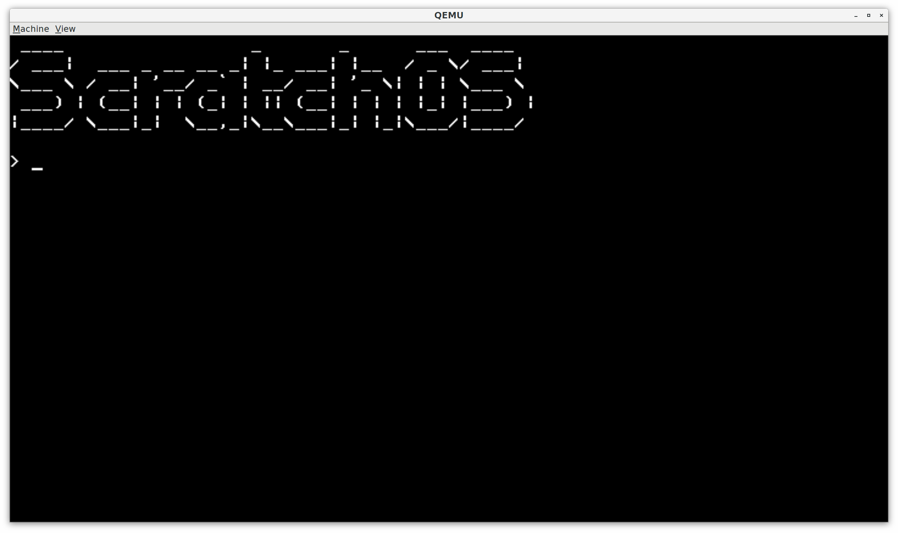

# ScratchOS

OwlOS is a tiny operating system developed for learning purposes. It is currently under development.

# License

This software is licensed under the Creative Commons Attribution-NonCommercial-ShareAlike 4.0 License.

